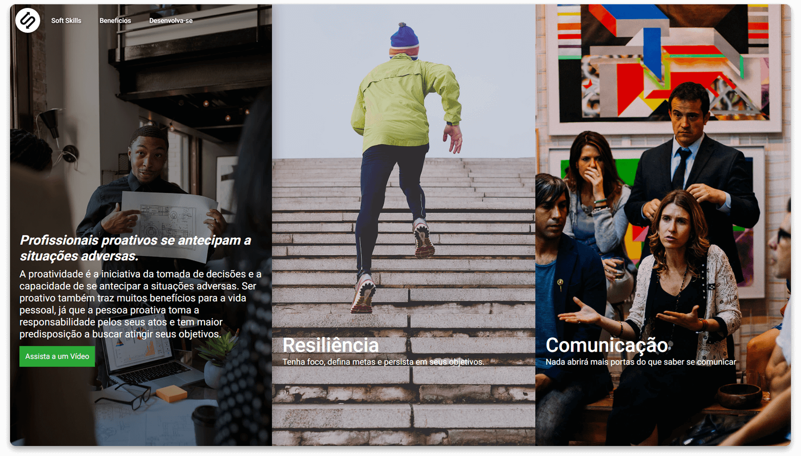

# Desafio Expansion Week

O Desafio pediu para que abordássemos uma **Soft Skill**, mas eu fui um pouco além e desenvolvi o projeto a partir da ideia de que há várias Soft Skills necessárias para um bom desenvolvimento profissional.
Dessa forma, fiz o projeto como uma **Landing Page** de um **Curso** de Desenvolvimento das Soft Skills que acho essenciais a um profissional de TI.

---

## Desktop

<h5 align="center">
  
</h5>

<h5 align="center">
  
</h1>

## Mobile

<h5 align="center">
  
</h5>

---

## Instalação

Entendendo que o **Yarn** está instalado no seu computador, siga:
1. Clone o Repositório.
2. Vá até o diretório do Repositório e rode ``yarn``.
3. Rode ``yarn start`` para iniciar o ReactJS.
